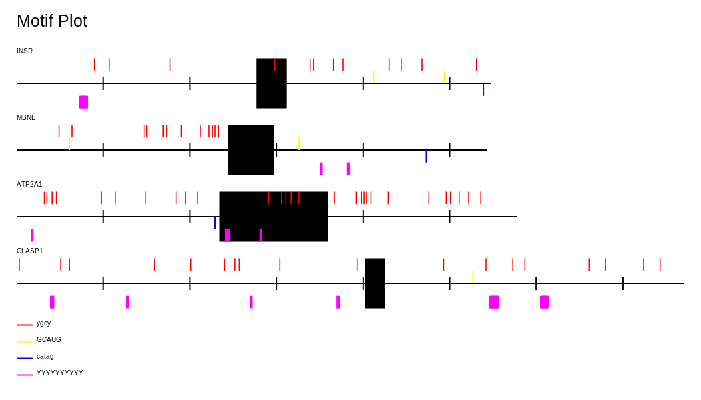

# Motif Marker

Created for Bi625, Bioinformatics and Genomics Master's Program at University of Oregon, Winter 2025. 

Generates diagram containing each sequence in input fasta with motifs highlighted. 

Outputs in .png format. 

## Usage

`motif-mark-oop.py [-h] -f FASTA -m MOTIF`

`-f`: Fasta format file of sequences. 
Each record must have at most a single continous exon denoted by capital bases. 
Output file will be named based on this file's base name (Example: `Figure_1.fasta` -> `Figure_1.png`). 

`-m`: Motif file, with a single motif sequence per line. Motif sequences must be IUPAC characters. 

## Dependencies

| Package | Version |
| --- | --- |
| pycairo | |
